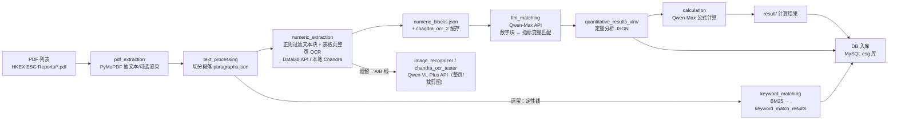

# ESG 数据管线全流程总览（LLM API 版）

> 本文描述**当前实际运行的版本**（本地 `ESG(1.0)` 代码库，LLM API 架构），并标注并存/遗留的旧链路。
> 相关：OCR 阶段细节见 `ESG_OCR_Complete_Documentation.md`；抽样核对结论见 §4。

> ✅ **版本基线（2026-08-01）**：本地 `~/Desktop/Y5S2/ESG/ESG(1.0)`。视觉与文本模型**全部走阿里云 DashScope API**（Qwen-VL-Plus 视觉 / Qwen-Max 文本）；本地 Qwen-VL/7B（`src/qwen_vl_local.py`）已 **DEPRECATED**。GitHub repo 上的 `src/`（2026-07-30）为早期版本，仅供参考。

---

## 1. 全流程总览图

---

## 2. 各阶段说明（当前主链路）

| 阶段 | 模块 | 输入 | 处理 | 输出 |
|---|---|---|---|---|
| S1 pdf_extraction | `pdf_extractor.py` (PyMuPDF) | PDF | 抽每页纯文本（可选渲染页图） | `text/{编号}.txt` |
| S2 text_processing | `text_processor.py` | text | 切分段落 | `paragraphs/{编号}/paragraphs.json` |
| S3 numeric_extraction | `numeric_extractor.py` | paragraphs + PDF | 文本块正则过滤（`_is_noise_line`/`_has_meaningful_numbers`）+ 表格页整页 OCR（**OCR_BACKEND 可配**：Datalab API / 本地 Chandra） | `numeric_extracts/{编号}/numeric_blocks.json` + `chandra_ocr_2` 缓存 |
| S4 **llm_matching** | `llm_variable_matcher.py` | **numeric_blocks.json** + `esg_indicator_keywords.json`（变量定义） | **Qwen-Max API** 把数字块匹配到指标变量（批内 3 块/次、内容截断 6000 字符、超时/重试） | `quantitative_results_vlm/{编号}/{编号}_quantitative_analysis.json` |
| S5 calculation | `calculator.py` | 定量分析 JSON + 公式 | Qwen-Max 公式计算/推导 | `result/{编号}/{编号}_calculation_result.json` |
| S6 入库 | `DB/*.py` | 定性/定量结果 | 写入 MySQL `esg` 库（含 PDF_URL 下载闭环） | MySQL 表 |

**并存/遗留链路**（仍可单独跑，非当前主线）：
- 定性线：`keyword_matcher.py`（BM25 + tokenizer）→ `keyword_match_results/{编号}/_results.json`
- A 线（旧定量）：`image_recognizer.py` 直接喂**整页 PNG** 给 Qwen-VL-Plus API → `quantitative_results_vlm/`
- B 线（旧定量）：`chandra_ocr_tester.py` **Datalab OCR** 出结构化 JSON → Qwen-VL 校正/归一 → `quantitative_results_ocr/chandra_ocr_2/`（表格临时裁剪图用后即删）
- `qwen_vl_local.py`：**DEPRECATED**（旧本地 Qwen-VL/7B 路径，已被 API 取代）

**API 配置**（`.env`）：`QWEN_VL_PLUS_API_KEY`（多模态，dashscope multimodal-generation）、`QWEN_MAX_API_KEY`（文本生成）、`OCR_BACKEND`（datalab_api / chandra_local）。

---

## 3. 关键设计点

1. **LLM API 化**：视觉（Qwen-VL-Plus）与文本（Qwen-Max）全部走 DashScope API，不再跑本地 7B——省本地显存、换精度与吞吐；代价是 API 费用与节流（git 历史：并发 8 worker 曾触发 API throttling，已回退到 4）。
2. **匹配质量有 GT 校验**：`gt_compare.py` / `run_llm_matching_all_gt.py` 对照 Ground Truth 打分（git 历史曾达 **GHG scope 单元格 70/70** 全对）。
3. **缓存即去重**：`chandra_ocr_2/` 存在即完成，支持断点续传。
4. **提示词工程**：变量定义全量入 prompt（曾修复截断问题）、scope 拆分 + 多年份、零值提取、turnover rate/energy 子项等专项规则。
5. **崩溃止损**（旧版沿用）：GPU 健康追踪 + PDF 黑名单。

---

## 4. 已知限制（2026-08-01 抽样核对结论）

1. **文本块过滤可靠**：CPU 正则稳定剔除无数字文本块。
2. **表格路径无数字过滤**：表格页整页 OCR 的块不检查「是否有数字」；检测器把图表/图片区域也圈为「表」（抽样 7 页为图表复合区域）。
3. **无逐表 id 关联**：`numeric_blocks` 块 `source` 恒为 `table_ocr`/`table_page`，与 OCR 缓存的 `table_block_id` 不直接关联——**无法逐表审计**「哪张表进了/没进」，只能页码粒度。
4. **代价**：整页高清图送 OCR（Datalab/Chandra）+ LLM API 调用费，成本高于「只裁表格小块」方案（旧 B 线的裁剪图策略在 API 版已弱化）。

**结论**：「准确去掉没有数字的表格」当前仍做不到（表格块不做数字校验 + 无法逐表验证）。改进见 §5。

---

## 5. 改进方向（建议，按优先级）

1. **表格/图表分类**（规则或轻量模型）在 OCR 前拦截图表区域，省 OCR/API 费用。
2. **数字存在性校验**：S3 对表格块也做「含数字」检查。
3. **建立可审计关联**：把 `table_block_id`（或页码+bbox）写入块 `source`，逐表可核对。
4. **LLM 匹配审计**：`llm_matching` 输出补 `traceability`（已含 page/table_block_id）与 dropped/skipped 明细（已实现一部分），汇总成可审计报告。

---

## 6. LLM / 定量抽取

### 6.1 现状（已实现，LLM API）

| 步骤 | 输入 | 处理（API） | 输出 |
|---|---|---|---|
| llm_matching | `numeric_blocks.json` + 变量定义 | **Qwen-Max**（dashscope 文本生成）批匹配（≤3 块/次、单块 ≤6000 字符） | `quantitative_results_vlm/{编号}/_quantitative_analysis.json` |
| calculation | 定量分析 JSON + 公式 | **Qwen-Max** 公式计算/推导（Scope 拆分、多年份、组件聚合） | `result/{编号}/_calculation_result.json` |
| 校验 | GT 表 | `gt_compare.py` 打分 | 匹配率报告（曾 70/70） |

> 关键澄清：**LLM 的输入是 numeric_blocks + 变量定义清单，不是「numeric_blocks + 整个 OCR 缓存」**。数字块 content 已含 OCR 内容；OCR 缓存用于留档/审计，不重复喂 LLM。

### 6.2 规划（未实现，待确认）

| 步骤 | 说明 |
|---|---|
| P1 正文段落语义增强 | 非表格正文也喂 LLM（当前正文只进 numeric_blocks 文本块） |
| P2 跨报告聚合 | 多份 PDF 指标合并、冲突消解 |
| P3 终检 LLM 校验 | 数值合理性 + 回看原文 + 缺失指标标注 |

---

**文档版本**：2.0（LLM API 版） ｜ **更新**：2026-08-01 ｜ 基于本地 `ESG(1.0)` 代码
