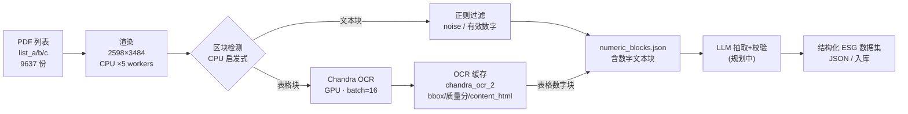

# ESG 数据管线全流程总览（含 LLM 结合规划）

> 本文是整条链路的「地图」：从 PDF 列表 → 高清渲染 → 区块检测 → GPU 表格 OCR → 数字提取，再到规划中的 **LLM 结合阶段**。
>
> **范围约定**：OCR 阶段的批处理/崩溃止损/缓存等细节见 `ESG_OCR_Complete_Documentation.md`；本文只画骨架与数据流。2026-08-01 抽样核对的关键结论已并入 §5。

---

## 1. 全流程总览图

---

## 2. 各阶段说明

| 阶段 | 算力 | 输入 | 处理 | 输出 |
|---|---|---|---|---|
| S0 输入 | - | `list_a/b/c`（PDF 列表） | 切分列表、均分任务 | 每 job 一个列表 |
| S1 渲染 | CPU ×5 | PDF | 渲染 2598×3484 高清页图 | 页图（内存/临时） |
| S2 区块检测 | CPU | 页图 | 文本块 / 表格块检测（启发式，**图表/图片可能误报为表**） | 文本块、表格块 |
| S2b 文本过滤 | CPU | 文本块 | `_is_noise_line` + `_has_meaningful_numbers` 正则 | 含数字的文本块 |
| S3 表格 OCR | GPU | 表格块 | Chandra OCR（batch=16） | OCR 结果（bbox/parse_quality/content_html） |
| S3b 缓存 | - | OCR 结果 | 写入 `chandra_ocr_2/<pdf>/<pdf>_ocr_output.json`（**以此判完成/去重**） | OCR 缓存 |
| S4 数字输出 | - | 文本块 + 表格 OCR | 组装 `numeric_extracts/<pdf>/numeric_blocks.json` | **最终数字结果** |
| S5 LLM（规划） | GPU/API | numeric_blocks + OCR 缓存 | 结构化抽取、标准化、校验 | 结构化 ESG 数据集 |

**横切机制**：GPU 健康追踪（`/tmp/gpu_health_status.json`）+ PDF 黑名单（`/tmp/pdf_blacklist.json`）崩溃止损；Slurm QoS 限 16 CPU/用户（3 job × 5 = 15 ≤ 16）；每 job 1 张 GPU + 1 主进程 + 5 数据 worker。

---

## 3. 关键设计点

1. **缓存即去重**：`chandra_ocr_2/<pdf>/` 存在即视为该 PDF 已完成，天然支持断点续传与多 job 并行不重复。
2. **算力分工**：CPU 干渲染+检测+文本过滤，GPU 只干表格 OCR；瓶颈在 CPU 渲染（GPU util 41–67%，未饱和）。
3. **崩溃快速止损**：GPU 报 CUDA 错立即停 worker + 标记坏卡 + 问题 PDF 入黑名单，避免空跑（Job 1013 前车之鉴）。
4. **worker 模型**：1 主进程 + N CPU 数据 worker（渲染/预处理） + 1 GPU；早期 `run_3stream.sh` 为 1 卡 3 主进程（3 个列表并行）。

---

## 4. 已知限制（2026-08-01 抽样核对结论）

> 抽样 10 份，对照 `chandra_ocr_2` 表区域 vs `numeric_blocks.json` 数字块。

1. **文本块过滤是可靠的**：CPU 正则能稳定剔除不含有效数字的文本块。
2. **表格块不做数字过滤**：表格路径上的块不经过「是否有数字」的检查，**没有数字的表格不会在表格路径上被主动剔除**。
3. **表格检测器有误报**：OCR 缓存中相当一部分「表区域」实为图表/图片（donut/pie/bar chart、infographic 等），它们会占用 GPU OCR 资源。
4. **OCR 缓存与 numeric 块无显式关联**：块的 `source`/`content` 不携带 `table_block_id`，**无法逐表验证「某张表是否进入最终结果」**——目前只能做内容分类 + 页码级覆盖分析。

**结论**：以当前实现，「准确去掉没有数字的表格」**尚不能做到**（既没有主动剔除，也无法审计验证）。改进方案见 §6。

---

## 5. 改进方向（建议，按优先级）

1. **表格/图表分类器**：在表格块送入 GPU 前，用规则或轻量模型/LLM 判别「真表格 vs 图表图片」，图表不再进 OCR（省 GPU、减少污染）。
2. **数字存在性校验**：S4 对 `has_table=True` 的块也做「含数字」检查，把无数字表格块真正剔除（当前只对文本块做了）。
3. **建立可审计关联**：把 `table_block_id`（或页码+bbox）写入块的 `source`，让「哪张表进了/没进最终结果」可逐表核对。
4. **数字块质量字段**：记录每个块的来源类型（text/table/chart）、检测分数，便于下游过滤与追溯。

---

## 6. LLM 结合阶段（规划中，待确认）

> 以下为建议的默认设计，**具体流程待确认后更新**。

| 步骤 | 输入 | 输出 | 说明 |
|---|---|---|---|
| L1 结构化抽取 | numeric_blocks + OCR 缓存 | 指标键值对 | LLM 从表格/文本块抽取「指标名/数值/单位/年度/口径」 |
| L2 标准化映射 | 抽取结果 | 标准化字段 | 单位换算、指标别名归一、中英/繁简对齐 |
| L3 聚合消解 | 标准化结果 | 指标面板 | 跨表、跨报告聚合与冲突消解 |
| L4 质量校验 | 结果 + 原文 | 校验报告 | 数值合理性、回看 OCR 原文核对、缺失指标标注 |

最终输出：**结构化 ESG 数据集**（JSON / 入库），供下游分析使用。

---

**文档版本**：1.0 ｜ **创建**：2026-08-01
