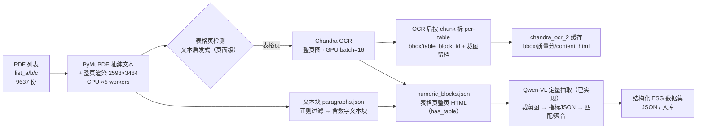

# ESG 数据管线全流程总览（含 LLM 结合规划）

> 本文是整条链路的「地图」：从 PDF 列表 → 高清渲染 → 区块检测 → GPU 表格 OCR → 数字提取，再到规划中的 **LLM 结合阶段**。
>
> **范围约定**：OCR 阶段的批处理/崩溃止损/缓存等细节见 `ESG_OCR_Complete_Documentation.md`；本文只画骨架与数据流。2026-08-01 抽样核对的关键结论已并入 §5。

---

## 1. 全流程总览图

---

## 2. 各阶段说明

| 阶段 | 算力 | 输入 | 处理 | 输出 |
|---|---|---|---|---|
| S0 输入 | - | `list_a/b/c`（PDF 列表） | 切分列表、均分任务 | 每 job 一个列表 |
| S1 抽取+渲染 | CPU ×5 | PDF | ① PyMuPDF 抽纯文本（段落、表格页检测用）；② 整页渲染 2598×3484 | paragraphs.json + 整页图 page_XXX.png |
| S2 表格页检测 | CPU | PDF 纯文本 | `_detect_report_table_pages` 文本启发式判定**哪些页**含表格（**页面级**，非 bbox；图表页也可能命中） | 表格页列表 |
| S2b 文本过滤 | CPU | paragraphs.json | `_is_noise_line` + `_has_meaningful_numbers` 正则 | 含数字的文本块 |
| S3 整页 OCR | GPU | 表格页**整页图** | Chandra OCR 整页（batch=16） | 整页 OCR 结果（html/chunks/parse_quality） |
| S3b 表格拆分 | CPU | OCR chunks + 整页图 | OCR **后**按 chunk bbox 裁每张表留档（`page_XXX_table_NN.png`），生成 table_block_id/bbox | chandra_ocr_2 缓存 + 表格裁剪图 |
| S4 数字输出 | - | 文本块 + 表格页整页 HTML | 组装 `numeric_extracts/<pdf>/numeric_blocks.json` | **最终数字结果** |
| S5 定量抽取 | GPU/API | **表格裁剪图** + table_block 富记录 + 变量定义 | Qwen-VL 抽指标 JSON → 变量匹配/聚合/公式补全（见 §6.1） | 每 PDF quantitative 结果 |
| S6 规划 | GPU/API | 正文段落（可选）/跨报告 | 语义增强、跨报告聚合、终检校验（见 §6.2，未实现） | 结构化 ESG 数据集 |

**横切机制**：GPU 健康追踪（`/tmp/gpu_health_status.json`）+ PDF 黑名单（`/tmp/pdf_blacklist.json`）崩溃止损；Slurm QoS 限 16 CPU/用户（3 job × 5 = 15 ≤ 16）；每 job 1 张 GPU + 1 主进程 + 5 数据 worker。

---

## 3. 关键设计点

1. **缓存即去重**：`chandra_ocr_2/<pdf>/` 存在即视为该 PDF 已完成，天然支持断点续传与多 job 并行不重复。
2. **算力分工**：CPU 干渲染+检测+文本过滤，GPU 只干表格 OCR；瓶颈在 CPU 渲染（GPU util 41–67%，未饱和）。
3. **崩溃快速止损**：GPU 报 CUDA 错立即停 worker + 标记坏卡 + 问题 PDF 入黑名单，避免空跑（Job 1013 前车之鉴）。
4. **worker 模型**：1 主进程 + N CPU 数据 worker（渲染/预处理） + 1 GPU；早期 `run_3stream.sh` 为 1 卡 3 主进程（3 个列表并行）。

---

## 4. 已知限制（2026-08-01 抽样核对结论）

> 抽样 10 份，对照 `chandra_ocr_2` 表区域 vs `numeric_blocks.json` 数字块。

1. **文本块过滤是可靠的**：CPU 正则能稳定剔除不含有效数字的文本块。
2. **表格块不做数字过滤**：表格路径上的块不经过「是否有数字」的检查，**没有数字的表格不会在表格路径上被主动剔除**。
3. **表格检测器有误报**：OCR 缓存中相当一部分「表区域」实为图表/图片（donut/pie/bar chart、infographic 等），它们会占用 GPU OCR 资源。
4. **OCR 缓存与 numeric 块无显式关联**：块的 `source`/`content` 不携带 `table_block_id`，**无法逐表验证「某张表是否进入最终结果」**——目前只能做内容分类 + 页码级覆盖分析。

**结论**：以当前实现，「准确去掉没有数字的表格」**尚不能做到**（既没有主动剔除，也无法审计验证）。改进方案见 §6。

---

## 5. 改进方向（建议，按优先级）

1. **表格/图表分类器**：在表格块送入 GPU 前，用规则或轻量模型/LLM 判别「真表格 vs 图表图片」，图表不再进 OCR（省 GPU、减少污染）。
2. **数字存在性校验**：S4 对 `has_table=True` 的块也做「含数字」检查，把无数字表格块真正剔除（当前只对文本块做了）。
3. **建立可审计关联**：把 `table_block_id`（或页码+bbox）写入块的 `source`，让「哪张表进了/没进最终结果」可逐表核对。
4. **数字块质量字段**：记录每个块的来源类型（text/table/chart）、检测分数，便于下游过滤与追溯。

---

## 6. LLM / 定量抽取（现状已实现 + 规划）

### 6.1 现状（代码已实现，`chandra_ocr_tester.py`）

**视觉 LLM 的输入是「表格裁剪图 + table_block 富记录」，不是 numeric_blocks。**

| 步骤 | 输入 | 处理 | 输出 |
|---|---|---|---|
| E1 整页 OCR | 表格页整页图 | DataLab API / 本地 Chandra（`ocr_layout`） | 整页 html/chunks（chunk 带 bbox/label） |
| E2 裁表格 | 整页图 + chunk bbox | `img.crop` 裁每张表 | `page_XXX_table_NN.png` + 富记录（table_block_id/bbox/content_html/section） |
| E3 视觉 LLM 抽取 | **表格裁剪图** + table_block + 变量定义 | Qwen-VL/7B `recognize_table_json_content_unified`，`_should_analyze_table_with_qwen` 门控（信号分低→skip） | 指标/数值/单位 JSON |
| E4 匹配聚合 | 抽取结果 | `_best_variable_match`（<45 丢）、定义门槛、报告期、组件聚合、Scope1+2 推导、公式补全 | 每 PDF quantitative 结果文件 |

> 关键澄清：`numeric_blocks.json`（S4）是 CPU 正则过滤后的**交付物/去重标记**，**不是** LLM 抽取的输入。文本块（paragraphs.json → 正则过滤）与表格路径各自独立产出，最终都汇入 numeric_blocks。

### 6.2 规划（未实现，待确认）

| 步骤 | 说明 |
|---|---|
| P1 正文段落语义增强 | 把非表格正文也喂 LLM（当前正文只进 numeric_blocks 文本块） |
| P2 跨报告聚合 | 多份 PDF 指标合并、冲突消解 |
| P3 终检 LLM 校验 | 数值合理性 + 回看 OCR 原文 + 缺失指标标注 |

最终输出：**结构化 ESG 数据集**（JSON / 入库），供下游分析使用。

---

**文档版本**：1.0 ｜ **创建**：2026-08-01
