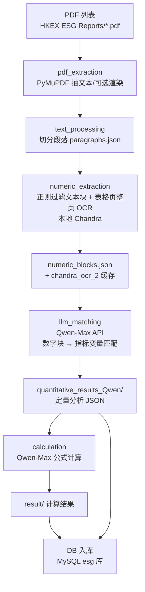

# ESG 数据管线全流程总览（LLM API 版）

> 本文描述**当前实际运行的版本**（本地 `ESG(1.0)` 代码库，LLM API 架构），并标注遗留的旧文件。
> 相关：OCR 阶段细节见 `ESG_OCR_Complete_Documentation.md`；抽样核对结论见 §4。

> ✅ **版本基线（2026-08-01）**：本地 `~/Desktop/Y5S2/ESG/ESG(1.0)`。视觉与文本模型**全部走阿里云 DashScope API**（Qwen-VL-Plus 视觉 / Qwen-Max 文本）；本地 Qwen-VL/7B（`src/qwen_vl_local.py`）已 **DEPRECATED**。GitHub repo 上的 `src/`（2026-07-30）为早期版本，仅供参考。

---

## 1. 全流程总览图

---

## 2. 各阶段说明（当前主链路）

| 阶段 | 模块 | 主要函数 | 输入 | 处理 | 输出 |
|---|---|---|---|---|---|
| S1 pdf_extraction | `pdf_extractor.py` (PyMuPDF) | `extract_text_from_pdf`（逐页 get_text） | `HKEX ESG Reports/{编号}.pdf` | PyMuPDF 抽每页文本层（可选渲染页图） | `extracted_text/{编号}.txt`（可选 `page_images/{编号}/page_XXX.png`） |
| S2 text_processing | `text_processor.py` | `split_into_paragraphs` / `process_text_file` | `extracted_text/{编号}.txt` | 按 `<PAGE n>` 标记切页 → 空行切段 → >20 字符保留 | `paragraphs/{编号}/paragraphs.json` |
| S3-1 渲染/检测 | `image_recognizer.py` | `_ensure_pdf_images`（渲染页图）、`_detect_report_table_pages`（表格页启发式检测）、`_load_pdf_text_content`（读文本层） | `HKEX ESG Reports/{编号}.pdf` + `extracted_text/{编号}.txt` | 渲染 `page_XXX.png`；按文本启发式判定含表格的页 | `page_images/{编号}/page_XXX.png` + 表格页清单 |
| S3-2 OCR | `chandra_ocr.py`（ChandraOCREngine） | `_run_page_ocr_batch`（批量 OCR 入口）、`_run_page_ocr_batch_chandra_local`（本地 Chandra 后端）、`_extract_table_blocks`（按 chunk 拆表，产出 bbox/table_block_id） | `page_images/{编号}/page_XXX.png`（表格页） | 整页 OCR（本地 Chandra） | OCR HTML → `chandra_ocr_2` 缓存（tables[]/page_html{}） |
| S3-3 编排/输出 | `numeric_extractor.py` | `_is_noise_paragraph`（噪声过滤）、`_has_meaningful_numbers`（有效数字，含零值词 zero/nil/no/none）、`_extract_text_blocks`（文本块）、`_extract_table_blocks`（表格块组装）、`_ocr_table_pages`（OCR 调度+缓存命中）、`_update_ocr_cache`（写 RICH 缓存） | `paragraphs/{编号}/paragraphs.json` + S3-2 OCR 结果 | 文本块过滤 + 组装 text/table 块 | `numeric_extracts/{编号}/numeric_blocks.json` + `chandra_ocr_2` 缓存 |
| S4 **llm_matching** | `llm_variable_matcher.py` | `_load_variable_list`（加载 extractable）、`match_variables_for_pdf`（入口）、`_build_variable_reference`（变量清单）、`_build_batch_prompt`（组 prompt） | **numeric_blocks.json** + `quantitative_variables.json`（33 条定量指标、**仅 extractable**；prompt 不含 keywords，2026-08-02 起） | **Qwen-Max API** 把数字块匹配到指标变量（智能分批：小块 ≤3/批、大表格独占一批、批 ≤15000 字符；单块超 12000 字符截前 8000+后 4000；超时/重试） | `quantitative_results_Qwen/{编号}/{编号}_quantitative_analysis.json` |
| S5 calculation | `calculator.py` | `calculate_variables` / `call_qwen_max_for_calculation` | `quantitative_results_Qwen/{编号}/..._quantitative_analysis.json` + 公式定义 | Qwen-Max 公式计算/推导 | `calculation_results/{编号}/{编号}_calculation_result.json` |
| S6 入库 | `DB/*.py` | — | `quantitative_results_Qwen/` + `calculation_results/` | 写入 MySQL `esg` 库（含 PDF_URL 下载闭环） | MySQL 表 |

**遗留文件**：
- `qwen_vl_local.py`：**DEPRECATED**（旧本地 Qwen-VL/7B 路径，已被 API 取代）

**API 配置**（`.env`）：`QWEN_VL_PLUS_API_KEY`（多模态，dashscope multimodal-generation）、`QWEN_MAX_API_KEY`（文本生成）、`OCR_BACKEND=chandra_local`（本地 Chandra，Datalab API 已不用）。

---

## 3. 关键设计点

1. **LLM API 化**：视觉（Qwen-VL-Plus）与文本（Qwen-Max）全部走 DashScope API，不再跑本地 7B——省本地显存、换精度与吞吐；代价是 API 费用与节流（git 历史：并发 8 worker 曾触发 API throttling，已回退到 4）。
2. **匹配质量有 GT 校验**：`gt_compare.py` / `run_llm_matching_all_gt.py` 对照 Ground Truth 打分（git 历史曾达 **GHG scope 单元格 70/70** 全对）。
3. **缓存即去重**：`chandra_ocr_2/` 存在即完成，支持断点续传。
4. **提示词工程**：变量定义全量入 prompt（仅 extractable；2026-08-02 起移除 keywords，每批省 ~2500 token）、scope 拆分 + 多年份、零值提取（文本路径已识别英文零值词 zero/nil/no/none）、turnover rate/energy 子项等专项规则。
5. **崩溃止损**（旧版沿用）：GPU 健康追踪 + PDF 黑名单。

---

## 4. 已知限制（2026-08-01 抽样核对结论）

1. **文本块过滤可靠**：CPU 正则稳定剔除无数字文本块；`_has_meaningful_numbers` 已识别英文零值词（zero/nil/no/none），"no fatalities" 类零值声明不再被误删。段落级 20 字符门槛经实测合理（滤掉 ~19% 短片段，几乎全为页码/目录/表格碎片，无有价值损失——实际扮演「表格碎片保险丝」）。
2. **表格路径无数字过滤**：表格页整页 OCR 的块不检查「是否有数字」；检测器把图表/图片区域也圈为「表」（抽样 7 页为图表复合区域）。
3. **无逐表 id 关联**：`numeric_blocks` 块 `source` 恒为 `table_ocr`/`table_page`，与 OCR 缓存的 `table_block_id` 不直接关联——**无法逐表审计**「哪张表进了/没进」，只能页码粒度。
4. **代价**：整页高清图送本地 Chandra OCR + LLM API 调用费，成本高于「只裁表格小块」方案。

**结论**：「准确去掉没有数字的表格」当前仍做不到（表格块不做数字校验 + 无法逐表验证）。改进见 §5。

---

## 5. 改进方向（建议，按优先级）

1. **表格/图表分类**（规则或轻量模型）在 OCR 前拦截图表区域，省 OCR/API 费用。
2. **数字存在性校验**：S3 对表格块也做「含数字」检查。
3. **建立可审计关联**：把 `table_block_id`（或页码+bbox）写入块 `source`，逐表可核对。
4. **LLM 匹配审计**：`llm_matching` 输出补 `traceability`（已含 page/table_block_id）与 dropped/skipped 明细（已实现一部分），汇总成可审计报告。

---

## 6. LLM / 定量抽取

### 6.1 现状（已实现，LLM API）

| 步骤 | 输入 | 处理（API） | 输出 |
|---|---|---|---|
| llm_matching | `numeric_blocks.json` + 变量定义（仅 extractable） | **Qwen-Max**（dashscope 文本生成）智能批匹配（小块 ≤3/批、大表格独占、批 ≤15000 字符；单块截断 12000 字符） | `quantitative_results_Qwen/{编号}/_quantitative_analysis.json` |
| calculation | 定量分析 JSON + 公式 | **Qwen-Max** 公式计算/推导（Scope 拆分、多年份、组件聚合） | `calculation_results/{编号}/_calculation_result.json` |
| 校验 | GT 表 | `gt_compare.py` 打分 | 匹配率报告（曾 70/70） |

> 关键澄清：**LLM 的输入是 numeric_blocks + 变量定义清单，不是「numeric_blocks + 整个 OCR 缓存」**。数字块 content 已含 OCR 内容；OCR 缓存用于留档/审计，不重复喂 LLM。

### 6.2 规划（未实现，待确认）

| 步骤 | 说明 |
|---|---|
| P1 正文段落语义增强 | 非表格正文也喂 LLM（当前正文只进 numeric_blocks 文本块） |
| P2 跨报告聚合 | 多份 PDF 指标合并、冲突消解 |
| P3 终检 LLM 校验 | 数值合理性 + 回看原文 + 缺失指标标注 |

---

**文档版本**：2.1（LLM API 版） ｜ **更新**：2026-08-02 ｜ 基于本地 `ESG(1.0)` 代码
